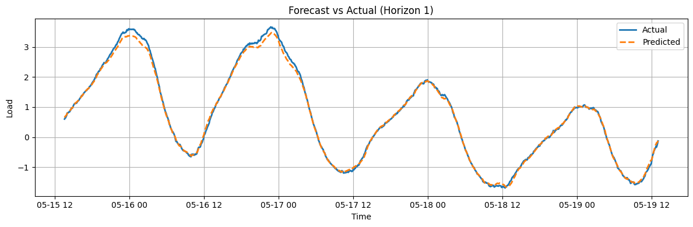
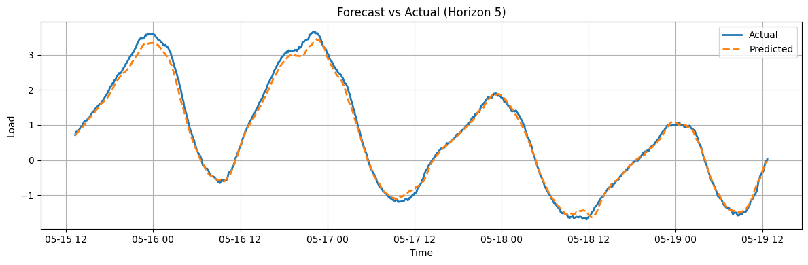
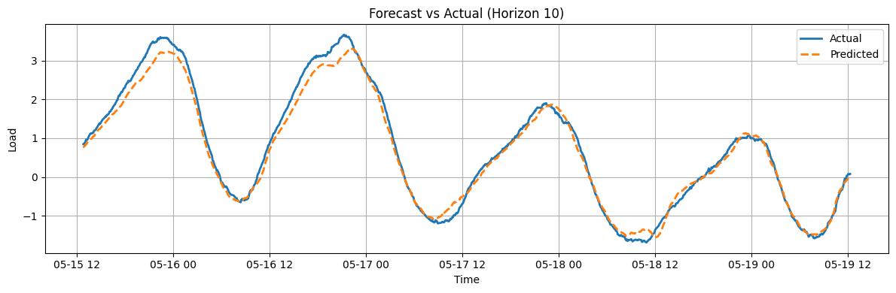
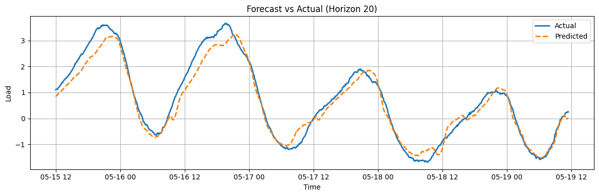
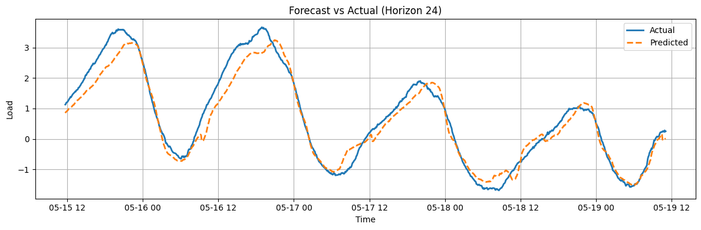

# Energy Consumption Forecasting with PJM + Weather Data

This project develops and evaluates machine learning models to forecast short-term regional electricity load within the PJM Interconnection, integrating real-time energy market data with external weather signals. The goal is to outperform PJM’s official forecasts using custom neural networks and autoregressive baselines.
Data Sources:

## PJM Energy Market: 
Real-time and day-ahead load forecasts, actual instantaneous demand.

OpenWeatherMap API: Weather data for major cities across the PJM grid footprint.

## Modeling Approaches:

Dual-stage attention-based Seq2Seq LSTM for multi-horizon load forecasting.

AR (autoregressive) baselines for comparison and ablation.

Forecasting 24 time steps (2 hours at 5-minute granularity).

## Infrastructure:

Trained and deployed using AWS SageMaker, leveraging cloud resources for scalability.

Evaluation performed via rolling MAE and MAPE across all 24 horizons.

## Performance:

Achieved up to 65% lower MAE than PJM’s official 2-hour-ahead forecasts in out-of-sample testing.

Real-time leaderboard and visualizations comparing personal forecasts vs. PJM vs. actuals.

